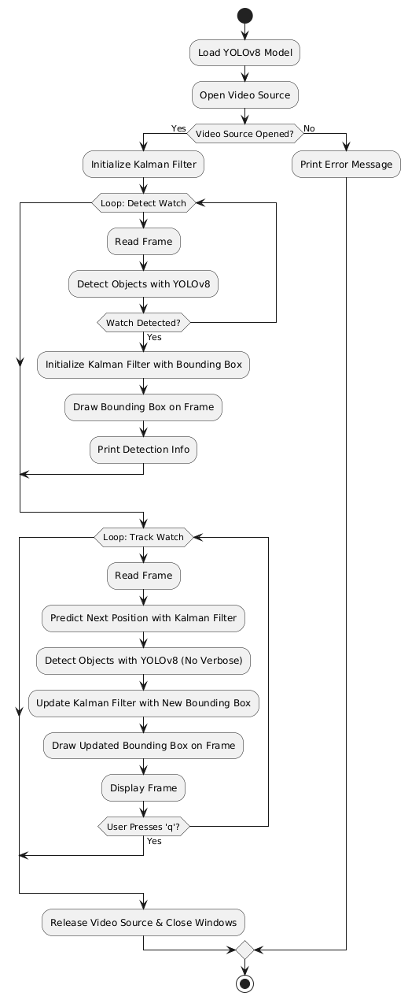
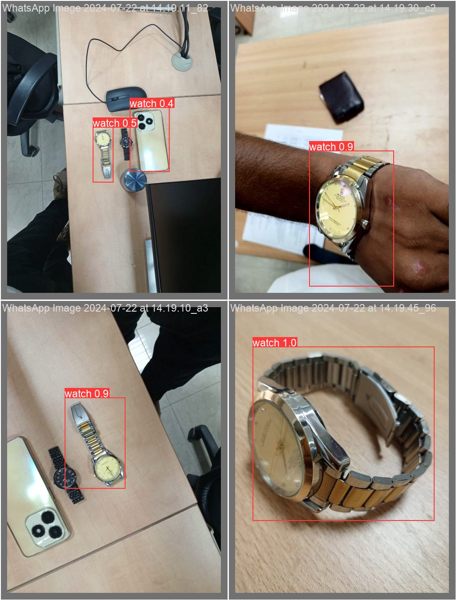

# Object_Detection_and_Tracking_using_yolov8_and_Optical_Tracker

## Environment setup

- Setup python environment
```
conda create -name optimal python=3.9
conda activate optimal
pip install -r requirements.txt
```

## Flowchart



## Dataset labeling

The images for training has been labeled by labelimg. labelimg can be installed easily by
- Install labelimg
```
pip  install labelimg
labelimg
```
Image labeling contains two files i.e images and labels.

## Dataset Training

This code has been tested on  Python 3.9, Pytorch , CUDA 11.8

## Training Results

These are the reproduction results from the training.
- Confusion_Matrix
It tells that how many images are predicted correctly during training.


- Training_Results


Our labeled image 


Predicted image 




## Result

- For real_time object tracking without bounding box use 'opticalflow2.py`
.png)
.png)
.png)

  - For real_time object tracking with bounding box use 'opticalflow1.py`

.png)
.png)
.png)
.png)

```

