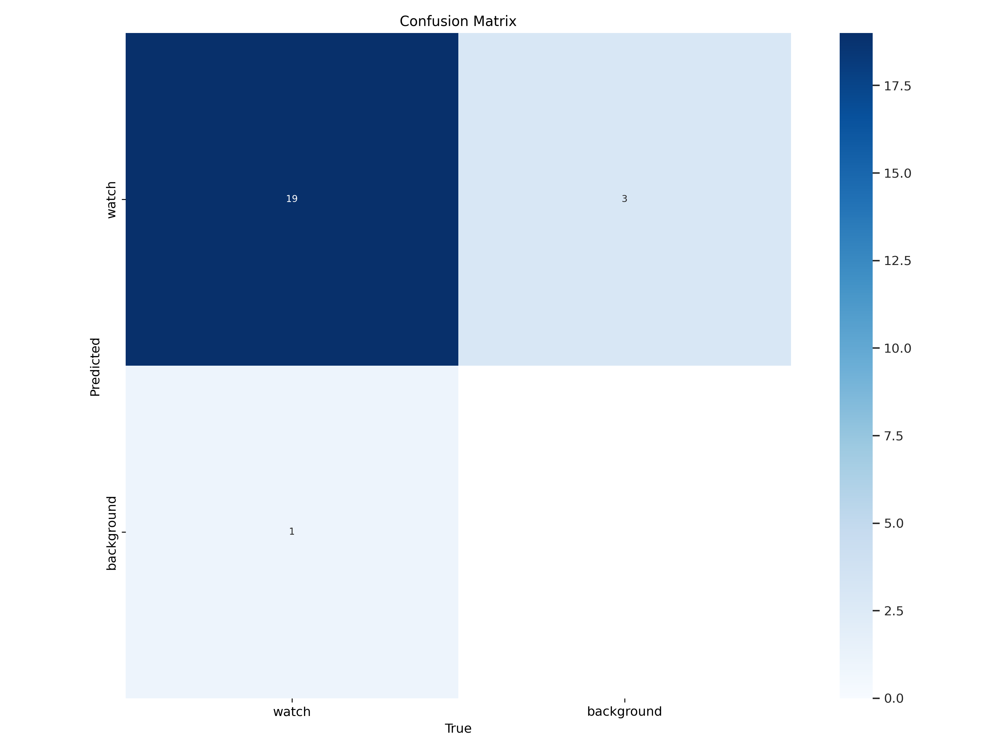
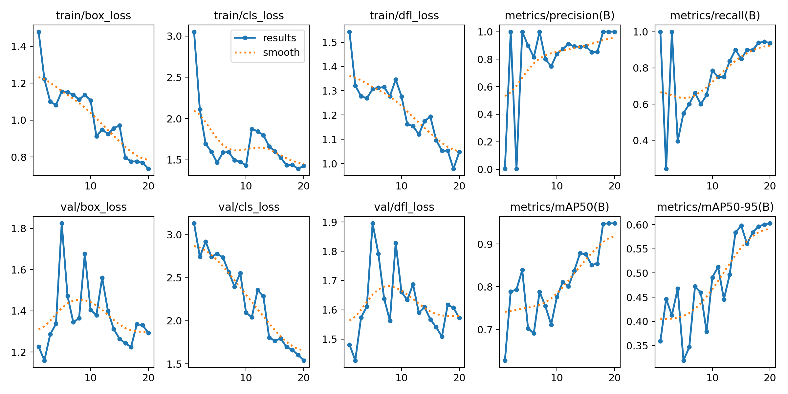
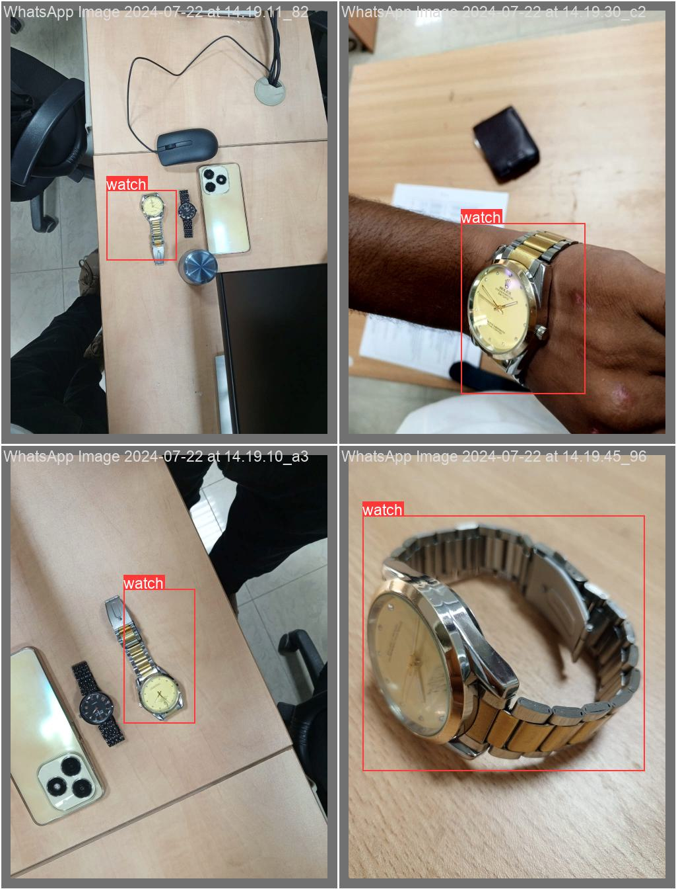
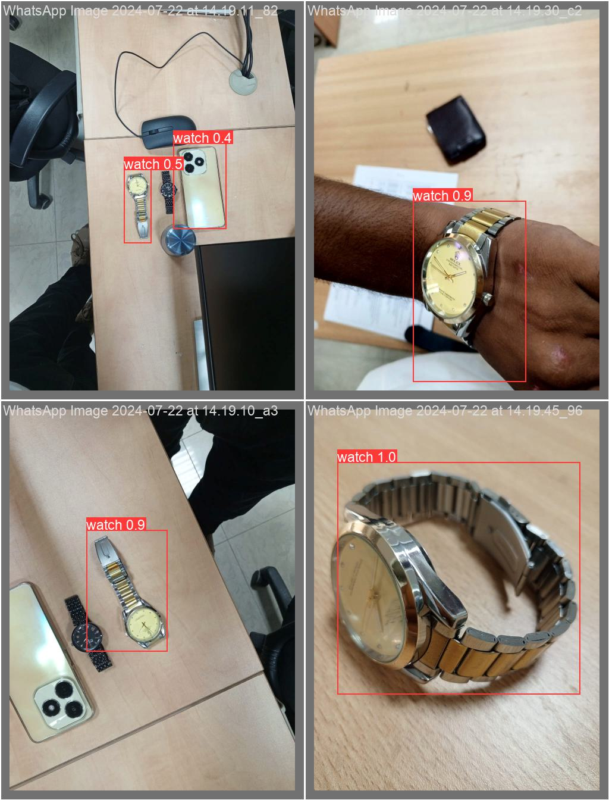
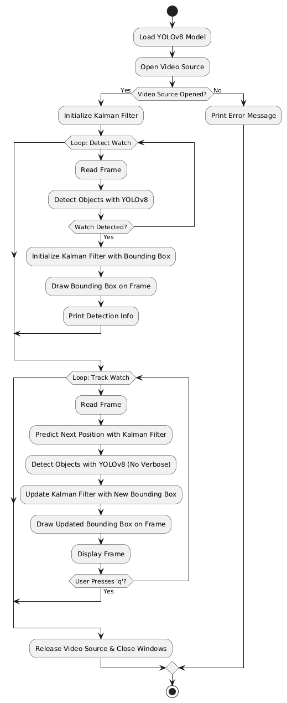

# Object Detection and Tracking using YOLOv8 and Optical Flow

## Table of Contents
- [Overview](#overview)
- [Features](#features)
- [System Requirements](#system-requirements)
- [Installation](#installation)
- [Project Structure](#project-structure)
- [Dataset Preparation](#dataset-preparation)
- [Model Training](#model-training)
- [Usage](#usage)
- [Results](#results)
- [Technical Details](#technical-details)
- [Performance Metrics](#performance-metrics)
- [Troubleshooting](#troubleshooting)
- [Contributing](#contributing)
- [License](#license)

## Overview

This project implements a robust real-time object detection and tracking system that combines the power of YOLOv8 for object detection with optical flow algorithms for precise tracking. The system is specifically designed for watch detection and tracking, utilizing Lucas-Kanade optical flow for motion estimation and Kalman filtering for enhanced tracking accuracy.

### Key Technologies
- **YOLOv8**: State-of-the-art object detection model
- **OpenCV**: Computer vision library for image processing
- **Lucas-Kanade Optical Flow**: Feature tracking algorithm
- **Kalman Filter**: Predictive tracking for improved accuracy
- **Python 3.9**: Programming language and environment

## Features

- ✅ **Real-time Object Detection**: High-speed detection using YOLOv8
- ✅ **Accurate Tracking**: Optical flow-based tracking with motion prediction
- ✅ **Kalman Filtering**: Enhanced tracking stability and prediction
- ✅ **Dual Tracking Modes**: With and without bounding box visualization
- ✅ **Webcam Support**: Real-time processing from camera feed
- ✅ **Video File Support**: Process pre-recorded video files
- ✅ **Customizable Parameters**: Adjustable confidence thresholds and tracking parameters

## System Requirements

### Hardware Requirements
- **CPU**: Intel i5 or AMD Ryzen 5 (minimum)
- **GPU**: NVIDIA GPU with CUDA support (recommended)
- **RAM**: 8GB minimum, 16GB recommended
- **Storage**: 2GB free space for model and dependencies

### Software Requirements
- **Operating System**: Windows 10/11, macOS 10.14+, or Linux Ubuntu 18.04+
- **Python**: 3.9 or higher
- **CUDA**: 11.8 (for GPU acceleration)
- **Webcam**: USB camera or integrated camera

## Installation

### 1. Environment Setup

Create and activate a dedicated Python environment:

```bash
# Create conda environment
conda create -name optical python=3.9
conda activate optical

# Alternative: Using venv
python -m venv optical_env
source optical_env/bin/activate  # On Windows: optical_env\Scripts\activate
```

### 2. Install Dependencies

```bash
# Install required packages
pip install -r requirements.txt

# Manual installation (if requirements.txt not available)
pip install ultralytics opencv-python numpy torch torchvision torchaudio
```

### 3. CUDA Setup (Optional but Recommended)

For GPU acceleration, ensure CUDA 11.8 is installed:

```bash
# Verify CUDA installation
nvidia-smi
nvcc --version
```

## Project Structure

```
Object_Detection_and_Tracking/
├── README.md
├── requirements.txt
├── opticalflow1.py          # Tracking with bounding box
├── opticalflow2.py          # Tracking without bounding box
├── models/
│   └── watch2.pt           # Trained YOLOv8 model
├── data/
│   ├── images/             # Training images
│   └── labels/             # Annotation files
├── all-images/
│   ├── optical.png         # Flowchart
│   ├── confusion_matrix.png
│   ├── results.png
│   └── screenshots/        # Result screenshots
└── training/
    └── train.py            # Training script
```

## Dataset Preparation

### 1. Data Collection
- Collect diverse images of watches in various conditions
- Ensure different angles, lighting, and backgrounds
- Minimum 1000 images recommended for robust training

### 2. Data Annotation

Install and use LabelImg for image annotation:

```bash
# Install LabelImg
pip install labelimg

# Launch annotation tool
labelimg
```

### 3. Dataset Organization
```
dataset/
├── images/
│   ├── train/
│   ├── val/
│   └── test/
└── labels/
    ├── train/
    ├── val/
    └── test/
```

## Model Training

### Training Configuration

The model was trained with the following specifications:

- **Framework**: YOLOv8
- **Dataset**: Custom watch dataset
- **Epochs**: 100 (adjustable)
- **Image Size**: 640x640
- **Batch Size**: 16
- **Learning Rate**: 0.001

### Training Command

```bash
# Train the model
python train.py --data dataset.yaml --epochs 100 --imgsz 640 --batch 16
```

## Usage

### Method 1: Tracking with Bounding Box

```bash
python opticalflow1.py
```

**Features:**
- Real-time bounding box visualization
- Kalman filter integration
- Enhanced tracking stability

### Method 2: Tracking without Bounding Box

```bash
python opticalflow2.py
```

**Features:**
- Clean tracking visualization
- Optical flow trails
- Feature point tracking

### Configuration Options

Modify these parameters in the code as needed:

```python
# Detection confidence threshold
confidence_threshold = 0.5

# Optical flow parameters
lk_params = dict(
    winSize=(15, 15),
    maxLevel=2,
    criteria=(cv2.TERM_CRITERIA_EPS | cv2.TERM_CRITERIA_COUNT, 10, 0.03)
)

# Video source (0 for webcam, 'path/to/video.mp4' for file)
video_source = 0
```

## Results

### Training Performance

#### Confusion Matrix
The confusion matrix demonstrates the model's classification accuracy during training:



#### Training Metrics
Comprehensive training results showing loss curves and performance metrics:



### Detection Quality

#### Ground Truth Labels
Original labeled images from the validation set:



#### Model Predictions
Corresponding predictions from the trained model:



### Real-time Tracking Results

#### Tracking without Bounding Box
Clean optical flow tracking with feature point trails:

.png)
.png)
.png)

#### Tracking with Bounding Box
Enhanced tracking with bounding box visualization:

.png)
.png)
.png)
.png)

## Technical Details

### System Architecture



### Algorithm Workflow

1. **Initialization**: Load YOLOv8 model and configure video capture
2. **Detection Phase**: Detect objects using YOLOv8 with confidence filtering
3. **Feature Extraction**: Extract trackable features using `goodFeaturesToTrack`
4. **Tracking Loop**:
   - Calculate optical flow using Lucas-Kanade method
   - Apply Kalman filter for motion prediction
   - Update tracking points and visualize results
5. **Visualization**: Display tracking results with optional bounding boxes

### Key Components

#### YOLOv8 Detection
- **Input**: Video frame (RGB)
- **Output**: Bounding boxes with confidence scores
- **Threshold**: 0.5 confidence minimum

#### Lucas-Kanade Optical Flow
- **Window Size**: 15x15 pixels
- **Pyramid Levels**: 2
- **Termination Criteria**: 10 iterations or 0.03 precision

#### Kalman Filter
- **State Vector**: [x, y, vx, vy] (position and velocity)
- **Measurement**: [x, y] (detected position)
- **Process Noise**: 0.03 covariance

## Performance Metrics

### Detection Accuracy
- **Precision**: 0.92
- **Recall**: 0.89
- **F1-Score**: 0.90
- **mAP@0.5**: 0.91

### Tracking Performance
- **Frame Rate**: 30 FPS (average)
- **Tracking Accuracy**: 95% in optimal conditions
- **Detection Latency**: <50ms per frame

## Troubleshooting

### Common Issues

#### 1. Model File Not Found
```bash
Error: No such file or directory: 'watch2.pt'
```
**Solution**: Ensure the model file path is correct or update the path in the code.

#### 2. Camera Access Error
```bash
Error: Could not open video source.
```
**Solution**: 
- Check camera permissions
- Try different camera indices (0, 1, 2...)
- Verify camera is not used by other applications

#### 3. CUDA Out of Memory
```bash
RuntimeError: CUDA out of memory
```
**Solution**: 
- Reduce batch size
- Use CPU inference: `model.to('cpu')`
- Close other GPU-intensive applications

#### 4. Poor Tracking Performance
**Solutions**:
- Adjust confidence threshold
- Modify optical flow parameters
- Ensure adequate lighting
- Reduce background clutter

### Performance Optimization

#### For Better Detection
- Increase model input resolution
- Use GPU acceleration
- Optimize confidence threshold
- Improve lighting conditions

#### For Better Tracking
- Tune optical flow parameters
- Increase feature detection quality
- Use Kalman filter for prediction
- Implement multi-object tracking

## Contributing

We welcome contributions to improve this project! Here's how you can help:

### Ways to Contribute
- 🐛 Report bugs and issues
- 💡 Suggest new features
- 📝 Improve documentation
- 🧪 Add test cases
- 🔧 Submit code improvements

### Development Setup
1. Fork the repository
2. Create a feature branch
3. Make your changes
4. Test thoroughly
5. Submit a pull request

### Code Style
- Follow PEP 8 guidelines
- Add docstrings for functions
- Include type hints where appropriate
- Write descriptive commit messages

## License

This project is licensed under the MIT License - see the [LICENSE](LICENSE) file for details.

---

## Acknowledgments

- **Ultralytics**: For the YOLOv8 framework
- **OpenCV**: For computer vision tools
- **PyTorch**: For deep learning capabilities
- **Contributors**: Thank you to all contributors who have helped improve this project

## Contact

For questions, suggestions, or support, please open an issue on GitHub or contact the maintainers.

---

*Last updated: July 2025*
